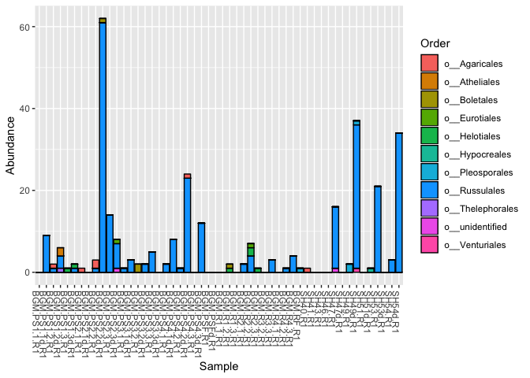

# Importing data and pre-processing


```r
library(phyloseq)
BGM_data0 <- import_biom(BIOMfilename = "../test/BGM_R1/otu_table.biom")
```

```
## Warning in strsplit(conditionMessage(e), "\n"): input string 1 is invalid
## in this locale
```

```r
BGM_data0
```

```
## phyloseq-class experiment-level object
## otu_table()   OTU Table:         [ 27292 taxa and 52 samples ]
## tax_table()   Taxonomy Table:    [ 27292 taxa by 7 taxonomic ranks ]
```


```r
#Renaming taxonomy levels on tax_table
colnames(tax_table(BGM_data0)) <- c("Kingdom", "Phylum", "Class","Order", "Family", "Genus", "Species")

#Filtering no hit at Kingdom level
BGM_data <- subset_taxa(BGM_data0, Kingdom != "No blast hit")
```

# Bar plot


```r
#summarizing by tax rank
BGM.order <- tax_glom(BGM_data, "Order")

plot_bar(BGM_data, fill = "Order")
```

<!-- -->

```r
plot_bar(BGM.order, fill = "Order")
```

<!-- -->

